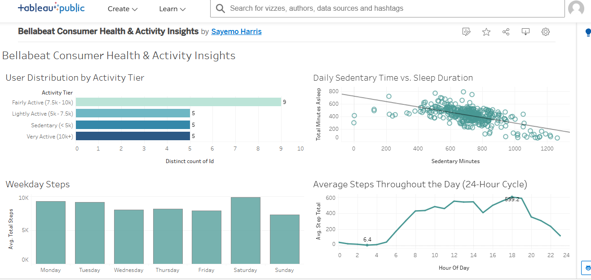

# 🌿 Bellabeat Consumer Health & Activity Case Study
**Google Data Analytics Professional Certificate — Capstone Case Study 2**

---

## 📌 Executive Summary
Bellabeat is a high-tech manufacturer of health-focused smart products designed specifically for women. This project evaluates non-Bellabeat smart fitness tracker data (FitBit Fitness Tracker Dataset) to analyze daily activity volume, sedentary behavior, intraday step fluctuations, and sleep quality.

The objective is to analyze consumer usage trends to inform Bellabeat's marketing strategy and optimize user engagement for the Bellabeat Leaf and Bellabeat App.

* **Live Interactive Dashboard:** [View on Tableau Public](https://public.tableau.com/views/BellabeatConsumerHealthActivityInsights/BellabeatExecutiveOverview?:language=en-GB&:sid=&:redirect=auth&:display_count=n&:origin=viz_share_link)
* **Technical Stack:** PostgreSQL (pgAdmin 4), Tableau Public, Python (Pandas), Microsoft Word

---

## 📊 Executive Dashboard Preview


---

## 🔍 Key Analytical Findings
1. **Sedentary Time vs. Sleep Disruption:** There is a notable inverse correlation ($r = -0.601$) between daily sedentary minutes and sleep duration. Users spending over 11 hours sitting per day experienced reduced sleep duration.
2. **The 10,000-Step Deficit:** Approximately **79.2% of users fail to achieve the 10,000 daily steps** benchmark. The largest user segment (37.5%) falls within the "Fairly Active" tier (7,500–9,999 steps).
3. **The 3:00 PM Activity Slump:** Intraday step volumes peak during commute hours (5:00 PM–7:00 PM, reaching ~600 steps/hour at 6:00 PM), with a noticeable dip around 3:00 PM during typical working hours.
4. **Weekend Cyclical Patterns:** Saturdays register the highest average physical activity levels of the week, followed by a shift on Sundays toward higher sedentary time.

---

## 💡 Strategic Marketing Recommendations
* **"The 2:30 PM Recharge":** Introduce gentle haptic notifications via the Bellabeat Leaf tracker at 2:30 PM to encourage short movement or hydration breaks, directly targeting the mid-afternoon activity slump.
* **"Bridge to 10K" Progressive Milestones:** Implement tiered in-app achievement badges (5k, 7.5k, 10k steps) to motivate users in the Fairly Active category without imposing discouraging, single-target benchmarks.
* **Circadian Sleep-Readiness Alerts:** Use daily sedentary metrics to trigger restorative wind-down notifications around 8:30 PM when daytime inactivity exceeds 10 hours.
* **Weekend Wellness Campaigns:** Align marketing community challenges with Saturday peak activity, complemented by Sunday guided recovery routines.

---

## 📁 Repository Structure
```text
├── 01_SCRIPTS/              # SQL schema definition, data cleaning, and analytical queries
├── 02_PROCESSED_DATA/       # Cleaned datasets and aggregated tables
├── 03_DOCUMENTATION/        # Complete executive case study report (.docx)
├── visualization/           # Tableau dashboard screenshots and visual assets
└── README.md                # Project documentation and summary
